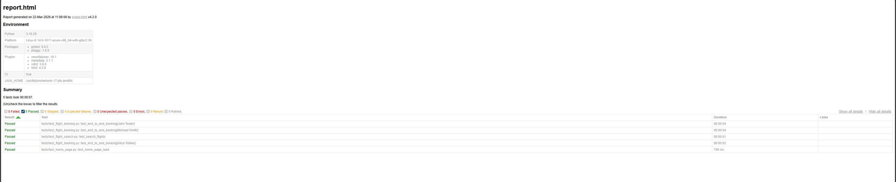

# Selenium Python BlazeDemo E2E Automation


End-to-end UI automation framework built using **Selenium, Python, and PyTest**.
The project automates a complete flight booking flow on **https://blazedemo.com/** using a clean **Page Object Model (POM)** architecture.

This repository demonstrates a realistic automation framework structure with logging, reporting, retry logic, parallel execution, and environment-based configuration.

---

# Tech Stack

* Python
* Selenium WebDriver
* PyTest
* Page Object Model (POM)
* PyTest HTML Reporting
* PyTest xdist (parallel execution)
* PyTest rerunfailures (retry failed tests)
* GitHub Actions (CI/CD)

---

# Test Scenario

The automation covers the following end-to-end workflow:

1. Search for available flights
2. Select a flight
3. Enter passenger details
4. Complete the booking
5. Verify the booking confirmation message

---

# Framework Features

* Page Object Model architecture
* Explicit waits for stable test execution
* Config-driven test settings
* Data-driven testing with PyTest parametrize
* Automatic screenshots on test failure
* Screenshots embedded in HTML reports
* Structured logging for debugging
* Parallel test execution
* Automatic retry of flaky tests
* CI/CD pipeline with GitHub Actions
* Headless test execution support
* Browser selection via CLI (`--browser`)
* Environment-based execution (`--env`)

---

# Project Structure

```
selenium-python-blazedemo-e2e
│
├── config
│   ├── config.ini
│   └── config_reader.py
│
├── data
│   └── passengers.py
│
├── pages
│   ├── base_page.py
│   ├── home_page.py
│   ├── flights_page.py
│   ├── purchase_page.py
│   └── confirmation_page.py
│
├── tests
│   ├── test_flight_booking.py
│   ├── test_home_page.py
│   └── test_flight_search.py
│
├── utils
│   ├── driver_factory.py
│   ├── logger.py
│   └── screenshot.py
│
├── logs
├── reports
├── screenshots
│
├── conftest.py
├── pytest.ini
├── requirements.txt
└── README.md
```

---

# Data Driven Testing

Passenger test data is defined in:

```
data/passengers.py
```

The test uses **PyTest parametrize** to execute the same test for multiple passengers.

---

# Installation

Clone the repository:

```
git clone https://github.com/CypherMorgan/selenium-python-blazedemo-e2e.git
cd selenium-python-blazedemo-e2e
```

Install dependencies:

```
pip install -r requirements.txt
```

---

# Running Tests

### Run all tests

```
pytest
```

### Run with verbose output

```
pytest -v
```

### Run in parallel

```
pytest -n 2
```

---

# Browser Selection (NEW)

Run tests on different browsers:

```
pytest --browser=chrome
pytest --browser=firefox
```

If not provided, browser defaults to config file.

---

# Environment Selection (NEW)

Run tests against different environments:

```
pytest --env=dev
pytest --env=staging
pytest --env=prod
```

Environment settings are defined in:

```
config/config.ini
```

---

# Headless Execution

Run tests in headless mode (used in CI):

```
pytest --headless
```

---

# CI/CD Pipeline

This project includes a **GitHub Actions pipeline** that:

* Runs tests on every push and pull request
* Executes tests in headless mode
* Generates HTML reports
* Uploads reports, logs, and screenshots as artifacts

---

# Test Reports

After execution, the framework generates:

```
reports/report.html
```

Includes:

* Pass / fail status
* Execution time
* Error stack traces
* Embedded screenshots

---

# Logging

Execution logs are stored in:

```
logs/test.log
```

Example:

```
HomePage | Searching flights: Boston -> London
FlightsPage | Selecting first available flight
PurchasePage | Filling passenger details
ConfirmationPage | Booking confirmation received
```

---

# Failure Screenshots

On test failure:

* Screenshot is captured automatically
* Saved in `screenshots/`
* Embedded in HTML report

---

# Test Reports

## Live Report (GitHub Pages)
👉 https://cyphermorgan.github.io/selenium-python-blazedemo-e2e/

## Report Preview


## CI Artifacts
Reports are also available in GitHub Actions:

Actions → Latest Run → Artifacts → report.html

---

# Future Improvements

* Data-driven testing using **CSV or Excel files**
* Allure reporting integration
* Docker + Selenium Grid for scalable parallel execution
* Test tagging (smoke / regression suites)

---

# Author

Automation framework created as a learning project while practicing **QA Automation using Selenium and Python**.
